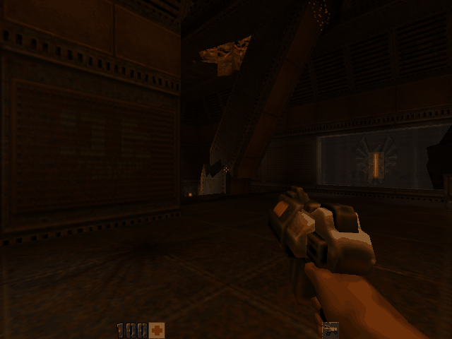

# Real games

Games run from their own folder, as the user's copy: in the browser through
the page's folder picker, in Node with `runtime/node/wine.mjs --folder`. None
of their files are in the repository.

| Game | Graphics | State |
| --- | --- | --- |
| Cave Story (freeware) | DirectDraw | Playable with sound (Milestone 5) |
| Quake II demo 3.14 | Software renderer (`ref_soft`, DirectDraw/GDI) | `demo1` renders and runs, in Node and in the browser |
| Quake II demo 3.14 | OpenGL (`ref_gl`, through `native/opengl32` over Direct3D 9) | `demo1` renders (recorded in Node, replayed on the GPU); not yet tried in a browser |
| Quake (shareware) on FTEQW | Direct3D 9 | Starts; exits before its window opens |
| Far Cry demo (2004) | Direct3D 9 (shader model 2 + fixed function) | Playable in the browser: menu, new game, the Fort level rendered (sky, terrain, water, foliage, distance fog, HUD), driving the boat, shooting, mouse look |
| Unreal Tournament 2004 demo | Direct3D 8/9 | In the browser: menus, Instant Action, a DeathMatch on DM-Rankin, walking and turning |

## Direct3D 9 against Wine's own tests

Wine's `dlls/d3d9/tests/visual.c` (134 rendering tests that read pixels
back) runs on translated Wine in headless Chrome, whose WebGPU draws the
frames. Run in batches of ten test functions (one hangs in a full run),
it found and measured these backend fixes, from 2105 failures to about 600:

* the fixed-function vertex pipe reported zero lights, so wined3d refused
  every `LightEnable` and lit geometry got only ambient light;
* fog was applied nowhere: Wine 11's HLSL fixed function leaves it to the
  backend, and the adapter never passed the fog states on; table fog now
  reads eye depth under a perspective projection, as Direct3D does;
* a second Direct3D device read back the first one's frames (fences
  numbered per device, while the core counts them per process), which
  also made each test spoil the next;
* ColorFill and blits to non-render-target surfaces drew nothing;
* pixel shaders 1.x never got `D3DTTFF_PROJECTED`;
* texture coordinate generation other than pass-through failed to compile.

Far Cry hits several of these (it runs on shader model 2 and fixed
function: lights, fog, projected lookups, texgen).

## Far Cry demo

What its rendering needed, besides the fixes above:

* **Fixed-function shaders above the backend's shader model.** wined3d
  turned away its own fixed-function shaders (HLSL compiled to shader model
  2.1) for a backend reporting less, then used the freed shader: menu
  frames came out black or garbage (the patch on `shader.c`).
* **A larger depth buffer.** Its reflection and shadow passes render to
  512x512 textures with the 800x600 depth buffer bound, which Direct3D 9
  allows and WebGPU does not; the core gives such passes a depth buffer of
  the target's size. The validation error had dropped whole frames.
* **Sampling the render target.** A draw that reads the texture it renders
  to now reads a copy taken before the draw.
* **The GPU's vendor.** As a "software" adapter it took a generic path
  whose terrain shaders compute fog for a lookup no hardware does, which
  fogged the whole level; the adapter now reports a card of the host GPU's
  vendor, as wined3d's GL and Vulkan adapters do.

To look at a frame in seconds rather than minutes, record the command
stream in Node and replay it on the GPU:

```sh
node runtime/node/wine.mjs --folder --d3d-record fc.rec.gz --input "..." FarCry.exe
FROM=113000 READ_EVERY=150 target/release/examples/replay fc.rec.gz out/
```

`FROM` skips drawing before that batch, `RS=28:0` overrides a render state
(here fog) to test a guess, `SHADERS=dir` saves the shaders for the
`d3dgpu-shader` translate example and `DUMP=full` prints every command.

## Unreal Tournament 2004 demo

From the demo's `System` folder, pick `UT2004.exe` (it starts fullscreen at
800x600). Reaching the menu takes about three and a half minutes in headless
Chrome. Its menus draw their own cursor from DirectInput's relative mouse
movement, so the page locks the pointer for a fullscreen Direct3D window
(click the screen; Esc releases it).

What it needed:

* **Rich edit.** `Window.dll` loads `RICHED32.DLL` by name and subclasses its
  class; the bundle's `richedit` group (riched20, riched32) is fetched when
  the program's files name it (tests/wine/win32/wndclass.c).
* **AVI files.** `WinDrv.dll` imports `AVIFIL32` (with `msvfw32`), in the
  media group.
* **Deep recursion.** Loading packages recursed deeper than the browser's
  stack holds when every guest call nests a WebAssembly call; translated
  calls now unwind to the dispatch loop past 1000 nested calls
  (tests/wine/win32/recursion.c).
* **Fixed-function texture coordinate generation.** Wine 11's HLSL
  fixed-function shaders only passed texture coordinates through; camera
  space normal, position, reflection vector and sphere map coordinates are
  now generated (the patch on `ffp_hlsl.c`). Without them maps drew black.

## Quake II demo

The demo is `q2-314-demo-x86.exe` (39,015,499 bytes, SHA-1
`5b4dedc59ceee306956a3e48a8bdf6dd33bc91ed`), id Software's self-extracting
ZIP, mirrored for example at
`https://ftp.gwdg.de/pub/misc/ftp.idsoftware.com/idstuff/quake2/`. Unzip it
(`unzip q2-314-demo-x86.exe 'Install/Data/*'`) and use `Install/Data` as the
game folder:

```sh
node runtime/node/wine.mjs --folder --screenshot q2.png --run-for 120000 \
  Install/Data/quake2.exe +set vid_ref soft +set vid_fullscreen 0 +map demo1
```

On the page: choose the `Install/Data` folder, pick `quake2.exe`, give the
same arguments, tick "on Wine" and run.

`ref_soft` draws with DirectDraw or a DIB section. `ref_gl` draws with
OpenGL, which runs on `native/opengl32`: OpenGL 1.1 turned into Direct3D 9
calls on Wine's d3d9, which draws with WebGPU (wined3d's WebGPU backend and
the d3dgpu core). Run it with `+set vid_ref gl` instead of `soft`. In Node
there is no GPU: `--d3d-record FILE` keeps the Direct3D command stream, and
`cargo run --release -p d3dgpu-core --example replay -- FILE OUT_DIR` draws
it on the native GPU (the frames come back in two readbacks each, 409 and
71 rows at 640x480).



What it needed:

* **Winsock.** `quake2.exe` imports `wsock32`; Wine's `ws2_32`, `wsock32`,
  `iphlpapi`, `dnsapi` and `nsi` are in the bundle's media group, and the host
  answers `ws2_32`'s Unix calls (name lookups) with no network. Single-player
  talks to its own server in memory.
* **Self-modifying code.** The software renderer patches immediates in its
  assembly every frame. Each patch drops the page's translations; fast mode
  translates within the code section around a miss and keeps translations by
  content, so the few versions the code cycles through are translated once.
  (Translating a 256 KB window each time, data included, ran Node out of
  memory in a minute.)
* **Threads.** See below.

## Quake on FTEQW

FTEQW (`fteqw.exe` from fte.triptohell.info, GPL) with the shareware
`id1/pak0.pak`, run with `+vid_renderer d3d9`. It loads `d3d9.dll` and
`d3dcompiler_47.dll` (built and bundled for programs that compile HLSL at run
time). It now gets past its worker-thread setup and the game data check, then
exits with code 5 before opening its window; not looked into yet.

## Fixes these games found

* **Waits completed only when nothing else could run.** With threads always
  ready, a blocked thread whose wait was satisfied never got its turn back
  (two FTEQW workers spinning on a set event starved the ones woken to reset
  it). Waits are now completed at least once a slice and right after an event
  is set or a semaphore or mutex released.
* **Spinning without system calls.** FTEQW's main thread waits for its
  workers in a loop that makes no system calls. Translated loops now check
  the thread's slice deadline at their back edges and yield (ABI version 6:
  a `preempt` import, a `tick` address, `cpu.PREEMPT_AT`).
* **Resuming a preempted loop at the wrong place, or from stale state.**
  Quake II's OpenGL renderer has wined3d compile fixed-function shaders with
  vkd3d while its sound threads run, so loops there get preempted, and
  resumed state has to be exact. Two things were not. The optimizer kept
  state such as `esp` and `ebp` only in temporaries inside a function,
  writing it back at calls and returns but not at loop back edges, where a
  preempted thread writes its state back and resumes; back edges now keep
  all dirty state live (`opt::preempt_points`). And a loop with two entries,
  made reducible with a dispatch header that carries one entry's address,
  resumed at that entry whichever was meant; the check now resumes at the
  entry its label setter names, or is left out where no address is known.
* **`*.*` matched nothing.** Wine's `FindFirstFile` turns `*.*` into NT's
  DOS wildcards (`<`, `>`, `"`), which the host's directory listing now
  understands; it also answers the `FileIdExtdBothDirectoryInformation` class
  Wine 11 asks for.
